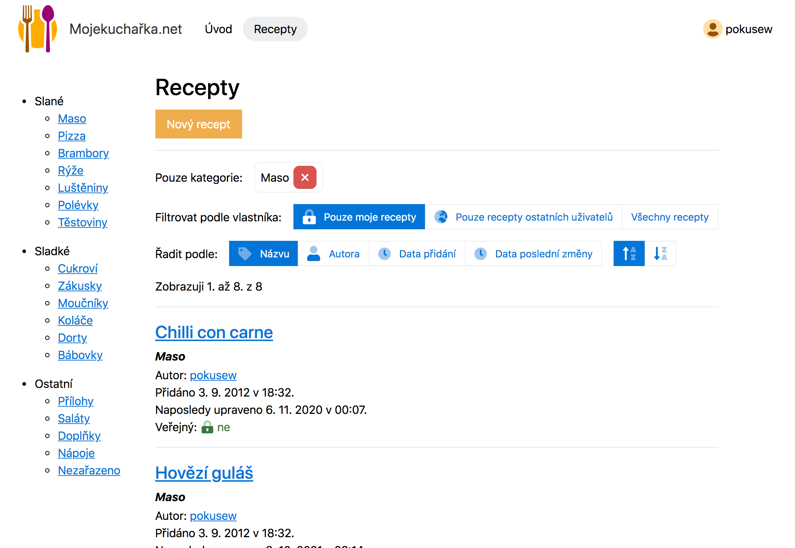

# Mojekucharka.net 2021

A simple web app for managing recipes

🚧 **Note:** This is work in progress.

<div style="text-align: center">

</div>

Written in **[PHP][php]** as an SSR (server-side rendered) web app that should work without JavaScript
(but with JavaScript it is more comfortable to use, i.e. [progressive enhancement][mdn-progressive-enhancement]).

Client-side scripts are written in **[TypeScript][typescript]**
and compiled to the latest ECMAScript (JavaScript).

The app targets **only modern browsers** (as it uses the latest HTML5, CSS and ECMAScript features).


## Content

<!-- **Table of Contents**  *generated with [DocToc](https://github.com/thlorenz/doctoc)* -->
<!-- START doctoc generated TOC please keep comment here to allow auto update -->
<!-- DON'T EDIT THIS SECTION, INSTEAD RE-RUN doctoc TO UPDATE -->

- [Description](#description)
- [User Manual](#user-manual)
- [Architecture](#architecture)
	- [Backend](#backend)
	- [Frontend](#frontend)
	- [Technology highlights](#technology-highlights)
		- [Features](#features)
		- [Frontend tooling](#frontend-tooling)
		- [Security](#security)
	- [Project structure](#project-structure)
- [Development](#development)
	- [Requirements](#requirements)
	- [Set up](#set-up)
	- [Available commands](#available-commands)
- [Deployment](#deployment)

<!-- END doctoc generated TOC please keep comment here to allow auto update -->


## Description

👉 See [this Google Docs document][mojekucharka-desc-doc] (in Czech).

[mojekucharka-desc-doc]: https://docs.google.com/document/d/1go3qb_ei5DVzYgW5VXdc5Khsog45C1alVgtiq0YLpaE/edit?usp=sharing


## User Manual

👉 See [User Manual 📘](./docs/USER-MANUAL.md).


## Architecture

_Note: The web app was created as a semestral project in the CTU's B6B39ZWA course, so the architecture was affected by
the [semestral project's requirements][ctu-zwa-semestral-project]._


### Backend

SSR web app in PHP, work without JS

no dependencies, no frameworks, plain PHP, everything from scratch

Apache, PHP, MySQL


### Frontend

HTML5, CSS, JavaScript (TypeScript compiled to the latest ECMAScript)

no dependencies, no frameworks, plain CSS/Sass, TypeScript, everything from scratch


### Technology highlights

#### Features
* HTML5 semantic elements
* CSS – fully responsive, Flexbox, Grid, animations, transitions, transforms, media queries, ...
* [PWA web app manifest](./frontend/manifest.json)
  including [maskable icons][web-dev-maskable-icons] (but no offline support)

#### Frontend tooling
* [webpack] – an assets bundler
* [Babel] – a JavaScript compiler (transpiler)
* CSS written in [Sass] (SCSS), vendor prefixes automatically added by [Autoprefixer]
  with [Browserslist]

#### Security
* [Subresource Integrity (SRI)][mdn-sri]
  for all scripts and styles
* Content Security Policy (CSP) (TODO)


### Project structure

Some directories contain feature-specific READMEs. The following diagram briefly describes the main directories and
files:

```text
. (project root dir)
├── .github - GitHub config (GitHub Actions)
├── design - design files
│   └── mojekucharka-logo.afdesign - Mojekucharka.net logo (Affinity Designer file)
├── app - backend source code
│   ├── ... (TODO: update diagram once backend is finished)
│   └── index.php - application entry-point
├── config - application config
│   ├── config.local.php - app config file
│   └── config.template.php - app config template
├── frontend - frontend source code
│   ├── scripts - scripts (forms validation, AJAX, etc.)
│   ├── images - mainly the PWA app icon
│   ├── styles - styles written in Sass (SCSS)
│   ├── index.js - the frontend bundle starting point
│   ├── manifest.json - a web app manifest for PWA
│   ├── .htaccess - Apache config file
│   └── robots.txt - robots.txt
├── deploy - deployments' specific scripts, configs and code
├── build - build output (webpack, deployment, ...)
├── log - app logs
├── vendor - app dependencies and the classes autoloader (generated by running Composer)
├── node_modules - frotnend dependencies (generated by running yarn)
├── tools - custom webpack plugins
├── types - TypeScript declarations for non-code imports (PNG)
├── .browserslistrc - Browserslist config
├── .eslintrc.js - ESLint config
├── .nvmrc - Node.js version specification (may be useful for some platforms)
├── babel.config.js - Babel config
├── postcss.config.js - PostCSS config
├── package.json - npm package (frontend dev dependencies, build scripts)
├── tsconfig.json - main TypeScript config
├── webpack.config.*.js - webpack configs
└── yarn.lock – Yarn lockfile
```


## Development

TODO: document and describe motivation, usage


### Requirements

- for running scripts: a POSIX-compliant OS (such as Linux, macOS) (Bash, make, sed, cp)
- [PHP] 7.4+ _(backend)_
- [Composer] _(PHP tooling)_
- [phpDocumentor] 3+ _(generating HTML docs from PHPDoc)_
- [Node.js] 16.x _(frontend tooling)_
- [Yarn-v1] 1.x _(frontend tooling)_
- You can follow [this Node.js and Yarn Development Setup guide](./NODEJS-SETUP.md).


### Set up

1. Install all PHP dependencies using Composer:
   ```bash
   composer install
   ```
2. Install all Node.js dependencies using Yarn:
   ```bash
   yarn
   ```
3. Start a frontend webpack development server with HMR and keep it running:
   ```bash
   yarn start
   ```
4. Run the app using the built-in PHP web server:
   ```bash
   make run
   # make SERVER=addr:port run
   ```
6. By default, the app will be listening on `http://localhost:8007/`.


### Available commands

* `yarn start` – Starts a frontend webpack development server with [HMR (hot module replacement)][webpack-hmr]. First,
  it builds the development version of the frontend assets and outputs them `dist` dir. Then it continuously and
  incrementally rebuilds the assets when sources (sourcecode) change. When it is possible (for styles and scripts), it
  applies the changes using [HMR][webpack-hmr] without the need for a full browser page refresh.

* `yarn build` – Builds the production version of the frontend assets and outputs them `dist` dir.  
  Note: Before running an actual build, `dist` folder is purged.

* `yarn analyze` – Same as `yarn build` but it also outputs `stats.json`
  and runs [webpack-bundle-analyzer CLI][webpack-bundle-analyzer-cli].

* `yarn tsc` – Runs TypeScript compiler. Outputs type errors to console.

* `yarn lint` – Runs [ESLint]. Outputs errors to console.

* `make run` – Runs the app using the built-in PHP web server.
	* Optional arguments:
		* `MODE` – `development` (default value), `production`
		* `SERVER` – `localhost:8007` (default value), any value with format `addr:port`
	* Usage examples:
		* `make MODE=development run`
		* `make MODE=production SERVER=localhost:4000 run`

* `make deploy` – Deploy the app to the specified target. Runs `deploy/$TARGET/deploy.sh`.
	* Optional arguments:
		* `TARGET` – `wa.toad.cz` (default value), `docs`
	* Usage:
		* `make deploy`
		* `make TARGET=wa.toad.cz deploy`

* `make destroy` – Destroys the app deployment on the specified target. Runs `deploy/$TARGET/destroy.sh`.
	* Optional arguments:
		* `TARGET` – `wa.toad.cz` (default value), `docs`
	* Usage:
		* `make deploy`
		* `make TARGET=wa.toad.cz deploy`

* `make lint` – Runs [PHPStan](https://phpstan.org/). Outputs errors to console. PHPStan will automatically use the
  [phpstan.neon](./phpstan.neon) config file in the project root.

* `make docs` – Generates HTML docs from PHPDoc using [phpDocumentor].

* `make docs-deploy` / `make-docs-deploy-destroy` – Deploys docs or destroy the deployment.


## Deployment

* the app to https://wa.toad.cz/~endlemar/:
	* see [these notes](./deploy/wa.toad.cz/README.md)
	* `make TARGET=wa.toad.cz deploy`
	* `make TARGET=wa.toad.cz destroy`

* the phpDocumentor-generated docs to https://mojekucharka-zwa-docs.netlify.app/:
	* see [these notes](./deploy/docs/README.md)
	* `make docs-deploy`
	* `make docs-deploy-destroy`

<!-- links references -->

[PHP]: https://www.php.net/manual/en/

[Composer]: https://getcomposer.org/

[PHPStan]: https://phpstan.org/

[phpDocumentor]: https://phpdoc.org/

[Node.js]: https://nodejs.org/en/

[Yarn-v1]: https://classic.yarnpkg.com/lang/en/

[webpack]: https://webpack.js.org/

[webpack-hmr]: https://webpack.js.org/guides/hot-module-replacement/

[webpack-bundle-analyzer-cli]: https://github.com/webpack-contrib/webpack-bundle-analyzer#usage-as-a-cli-utility

[Babel]: https://babeljs.io/

[Sass]: https://sass-lang.com/

[Autoprefixer]: https://github.com/postcss/autoprefixer

[Browserslist]: https://github.com/browserslist/browserslist

[TypeScript]: https://www.typescriptlang.org/

[ESLint]: https://eslint.org/

[mdn-progressive-enhancement]: https://developer.mozilla.org/en-US/docs/Glossary/Progressive_Enhancement

[mdn-sri]: https://developer.mozilla.org/en-US/docs/Web/Security/Subresource_Integrity

[web-dev-maskable-icons]: https://web.dev/maskable-icon/

[ctu-zwa-semestral-project]: https://cw.fel.cvut.cz/wiki/courses/b6b39zwa/classification/semestralka
