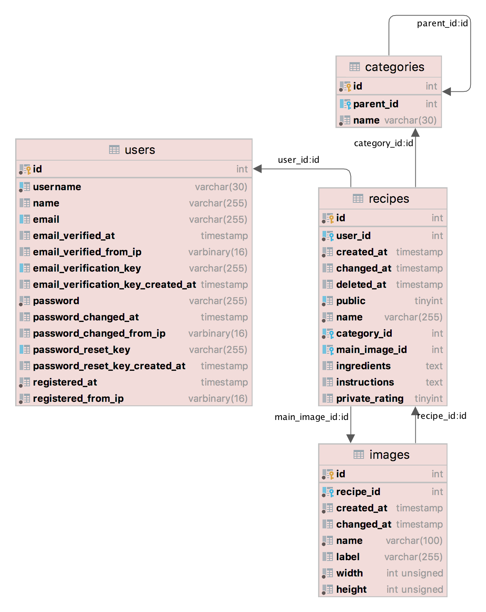
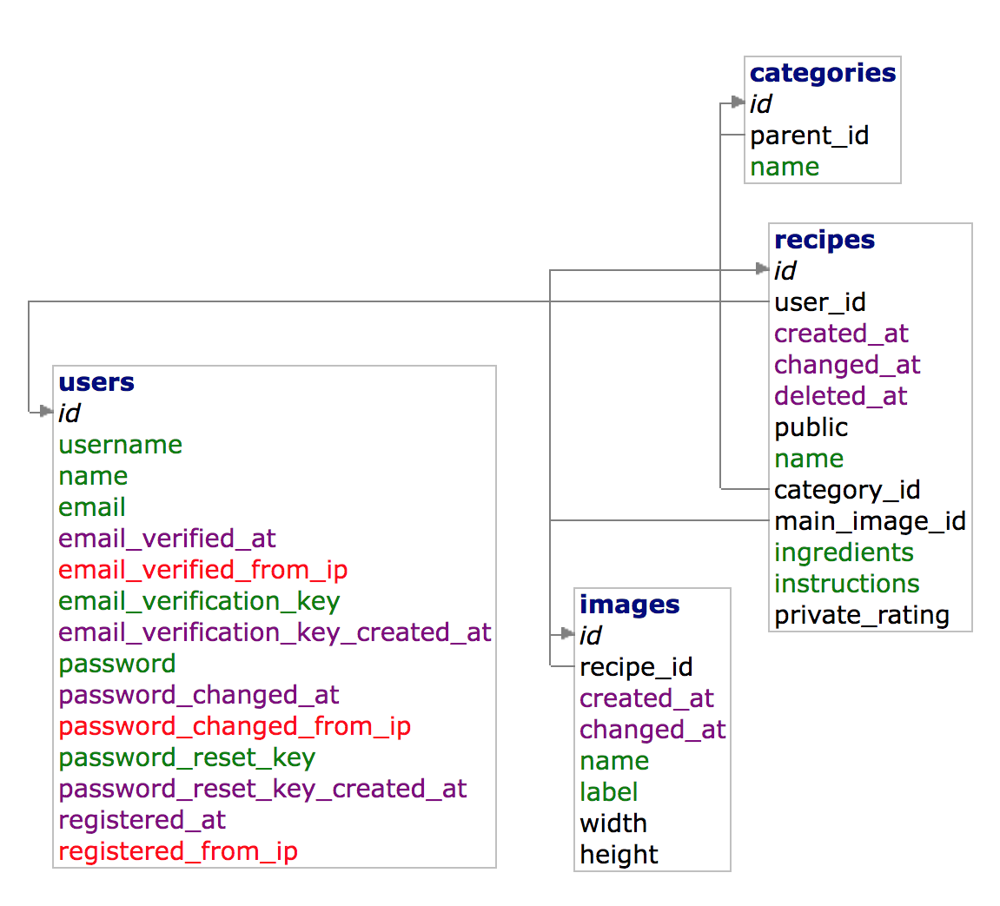

# Technical Manual for Mojekucharka.net 2021

This document describes the architecture of the Mojekucharka.net web application and the technologies on which it is
built.

---

🌐 App main deployment: https://wa.toad.cz/~endlemar/  
📖 phpDocumentor-generated docs (only for PHP
code): [mojekucharka-zwa-docs.netlify.app](https://mojekucharka-zwa-docs.netlify.app/)

---

_Note: The web app was created as a semestral project in the CTU FEE [B6B39ZWA course][ctu-fee-zwa], so the architecture
was affected by the [semestral project's requirements][ctu-fee-zwa-semestral-project]._

It is written in **[PHP][php]** as an SSR (server-side rendered) web app that should work without JavaScript
(but with JavaScript it is more comfortable to use, i.e. [progressive enhancement][mdn-progressive-enhancement]).

Client-side scripts are written in **[TypeScript][typescript]**
and compiled to the latest ECMAScript (JavaScript).

The app targets **only modern browsers** (as it uses the latest HTML5, CSS and ECMAScript features).

🛠️ The whole project uses some **standard tooling** that is described in
the [Technology highlights section](../README.md#technology-highlights) and
the [Development section](../README.md#development) in the project's main README.

📌 **For the local development setup guide**, please refer to the [Development section](../README.md#development) in the
project's main README, which covers setting up everything so that you can get the app running locally on your machine.

👉 If you want to know **where to find the source code**, see the [Project structure](#project-structure) section.

## Content

<!-- **Table of Contents**  *generated with [DocToc](https://github.com/thlorenz/doctoc)* -->
<!-- START doctoc generated TOC please keep comment here to allow auto update -->
<!-- DON'T EDIT THIS SECTION, INSTEAD RE-RUN doctoc TO UPDATE -->

- [Motivation](#motivation)
- [The Framework](#the-framework)
    - [Routing](#routing)
    - [Forms](#forms)
    - [Database](#database)
- [The App](#the-app)
    - [Database schema](#database-schema)
    - [Interactive Form Validation with the Shake Effect](#interactive-form-validation-with-the-shake-effect)
    - [E-mails sending](#e-mails-sending)
- [Production third-party dependencies](#production-third-party-dependencies)
- [Project structure](#project-structure)
- [Development](#development)
- [Deployment](#deployment)

<!-- END doctoc generated TOC please keep comment here to allow auto update -->


## Motivation

Because third-party libraries were not allowed to be used, I had to build some foundation for the app from scratch. The
main objectives were:
* Support easy code reuse. For example: Implement the form validation once and then reuse it everywhere else.
* Robust error handling.
* Split the business logic from the presentation layer (e.g. templates).
* Split the network layer (handling HTTP request / responses) from the application logic.
* Make it easily testable (i.e. one can run the individual parts independently).
* Do not add unnecessary abstraction. KISS

So I designed a micro MVC framework to fulfill these objective.

I was very inspired by the [Nette Framework](https://nette.org/) and its architecture which I have used in the past. I
was also influenced by my experience with the modern JS ecosystem (npm, Node.js, JavaScript, TypeScript, React.js).

In the next section, I briefly describe the framework. Then I introduce the app-specific code and mention its main
elements.

This description is not comprehensive. It provides just a high-level info. Please look into the PHPDoc or directly into
the implementation code. It is relatively good documented and organized and should be readable.


## The Framework

It consists of loosely-coupled classes that live in the `Core`[\[api\]][api-Core][\[src\]](../app/Core/) namespace. For
this reason, we can (and we will) refer to it as the Core framework.

At the heart of the framework lies **the Dependency Injection (DI) container**
`Core\DI\Container`[\[api\]][api-Core\DI\Container][\[src\]](../app/Core/DI/Container.php).

It is quite powerful, yet very simple. It is built on the PHP Reflection API. It supports **autowiring** of constructor
parameters and instance properties. It also allows registration of custom factories that can then handle new instances
creation for the specific types. It also supports autowiring of custom parameters
from `Core\Config`[\[api\]][api-Core\Config][\[src\]](../app/Core/Config.php).

The Core framework is loosely-modelled after the MVC pattern.
* The `Core\App`[\[api\]][api-Core\App][\[src\]](../app/Core/App.php) is the front controller.
* The presenters (subclasses `Core\UI\Presenter`[\[api\]][api-Core\UI\Presenter][\[src\]](../app/Core/UI/Presenter.php))
  act as page controllers.
* No special template engine is used. Instead, we use plain PHP files that are rendered in
  `Core\UI\Presenter::render()`[\[api\]][api-Core\UI\Presenter::render()][\[src\]](../app/Core/UI/Presenter.php#L363))
  in the context of the presenter. See for example, the app's [recipe.php](../app/App/Presenter/templates/recipe.php)
  template.

**The HTTP request to HTTP response flow is as follows (simplified):**
1. Create a new instance of `Core\DI\Container` and pass `Core\Config` to it.
    1. The config should define factories for the `Core\Http\HttpRequest` and `Core\Http\HttpResponse` instances
       creation.
    2. The default are `Core\Http\HttpRequestFactory` and `HttpResponseFactory` resp.
2. Get the `Core\App` instance from the container (it will be auto-created and its parameters autowired)
   and run it using `Core\App::run()`.
3. The `Core\App::run()` method uses `Core\Routing\Router` that tries to match the HTTP request `Core\Http\HttpRequest`
   to a known route.
4. From the route, the app knows the presenter name.
5. Create a new instance of the requested presenter, fail if it cannot be done.
6. Run the presenter using `Core\UI\Presenter::run()`. The matched route is passed as parameter to the method.
7. From the route, the presenter knows the action name.
8. It tries to invoke the corresponding action method with its parameters matching those in the route match, it fails,
   if it cannot do it.
9. The action method runs. It sets view name.
10. The view gets rendered to string.
11. The string is returned as response.

During the presenter action method runtime, an `Core\Exceptions\AbortException` can be thrown, which causes an immediate
termination of the presenter and sending of the response if there is any. It is caught inside
the `Core\UI\Presenter::run()` method. The AbortException is used for example for doing redirects.

If any uncaught exception occurs inside the presenter, it is caught by the app. The app then tries to instantiate the
error presenter (which is a bit special presenter whose short name is ErrorPresenter). The exception is then passed to
the error presenter.

If any uncaught exception occurs even inside the error presenter, it is also caught by the app. The app logs it and
renders a generic 500 Server Error response.


### Routing

The Core framework implements two-way routing. Each HTTP request URL is mapped to a `Core\Routing\Route` (a logical
address) and vice-verse. However, it is possible to define one-way (matching only) routes.

The logical address comprises presenter name (always present) and optional action name. On top of that, there can be
also a key-value array of route parameters.

See [the app router definition](../app/App/RouterFactory.php) to get the idea on how it is used.

See the `Core\Routing`[\[api\]][api-Core\Routing][\[src\]](../app/Core/Routing/) namespace to get an overview.


### Forms

The Core framework contains a simple abstraction over HTML forms that helps with common tasks. It allows declarative
building of forms. It handles validation and normalization.

See the `Core\Forms`[\[api\]][api-Core\Forms][\[src\]](../app/Core/Forms/) namespace to get an overview.


### Database

The Core framework contains a very lightweight utility classes to be used with PDO that simplifies normal operations
while retaining the access to the low-level API (raw/prepared SQL queries) if it is needed.

See the `Core\Database`[\[api\]][api-Core\Database][\[src\]](../app/Core/Database) namespace to get an overview.


## The App

The app lives in the `App`[\[api\]][api-App][\[src\]](../app/App/) namespace.

It contains the presenters and templates that actually implement all the functionality of Mojekucharka.net web app.


### Database schema

The app uses MySQL database to store its data. The schema DDL files can be found in the [db/schema](../db/schema/)
directory. The following diagrams provide visual representations:

<div style="text-align: center">

</div>

<div style="text-align: center">

</div>

_Note: Although that the support for images has not been finished in the final app, some initial work has been done (the
idea on how it should work, the table schema, even the empty ImagesRepository in the source code)._


### Interactive Form Validation with the Shake Effect

**A great care has been given into the implementation of a robust and user-friendly forms validation.**

The result is demonstrated in this video: 👉 **[Interactive Form Validation Shake Effect][shake-effect-video]**
(or use [this Google Drive link][shake-effect-video-google-drive]).

It is (superficially) described in the [User Manual Section](./USER-MANUAL.md) “Popis validace formulářů”.

The JS script that does the work is in [frontend/scripts/forms.ts](../frontend/scripts/forms.ts).

It is worth mentioning also the use of Web Animations API in [frontend/scripts/shake.ts](../frontend/scripts/shake.ts)
to change the state (restart) of the given CSS animation from JS.

Lastly, the CSS “shake” animation is defined in [frontend/styles/_animations.scss](../frontend/styles/_animations.scss).

[shake-effect-video]: ./images/ui/form-validation-shake-effect.mov

[shake-effect-video-google-drive]: https://drive.google.com/file/d/1vQZDJVsIJG45tKBZ9vvzB2Uh63Pwnwc9/view?usp=sharing


### E-mails sending

The app sends e-mails from `@mojekucharka.net` domain. The e-mail server and the DNS records were configured with secure
combination of **DKIM + SPF + DMARC** so that no e-mail spoofing is easily possible.

The application communicates with the remote mail server (that handles the sending) using the SMTP protocol. Because PHP
does not contain a built-in SMTP implementation, and I did not have time to write one from scratch, I've chosen
the `Nette\Mail\SmtpMailer`[\[src\]](https://github.com/nette/mail/blob/master/src/Mail/SmtpMailer.php)
which is a part of the [nette/mail](https://doc.nette.org/en/mail) package (from which I've used also other e-mail
messages-related abstractions).


## Production third-party dependencies

**Backend:**
* Composer: `nette/mail`, see [E-mails sending](#e-mails-sending)
* Composer: `tracy/tracy`, [Tracy](https://tracy.nette.org/), no effect in production (apart logging fatal errors
  see [Core\App, line 148](../app/Core/App.php#L148)), but an invaluable help duration development
* Composer: `nette/utils`, because of the `Nette\Utils\Html`, a very simple util, but with a powerful PHPDoc

**Frontend:**
* none


## Project structure

🌐 Main deployment: https://wa.toad.cz/~endlemar/  
📖 phpDocumentor-generated docs (only for PHP
code): [mojekucharka-zwa-docs.netlify.app](https://mojekucharka-zwa-docs.netlify.app/)

The most important directories/files are:
* [app](../app/) – backend source code (the App, the Core framework)
* [app/index.php](../app/index.php) – the app's entry-point
* [config/config.template.php](../config/config.template.php) – the app's config (template)
* [frontend/scripts](../frontend/scripts/) – the frontend JavaScript scripts
* [frontend/styles](../frontend/styles/) – the CSS styles

Some directories contain feature-specific READMEs. The following diagram briefly describes the main directories and
files:

```text
. (project root dir)
|
├── app - backend source code
│   ├── App - the app source code (uses the Core)
│   ├── Core - Core framework
│   └── index.php - app entry-point
├── config - application config
│   ├── config.local.php - app config file
│   └── config.template.php - app config template
├── log - app logs
├── vendor - app dependencies and the classes autoloader (generated by running Composer)
├── composer.json
├── phpstan.neon
├── phpdoc.dist.xml – phpDocumentor config
│
├── frontend - frontend source code
│   ├── scripts - scripts (mainly forms validation)
│   ├── images - mainly the PWA app icon
│   ├── styles - styles written in Sass (SCSS)
│   ├── index.js - the frontend bundle starting point
│   ├── manifest.json - a web app manifest for PWA
│   └── robots.txt - robots.txt
│
├── package.json - npm package (frontend dev dependencies, build scripts)
├── node_modules - frontend dependencies (generated by running yarn)
├── tools - custom webpack plugins
├── types - TypeScript declarations for non-code imports (PNG)
├── .browserslistrc - Browserslist config
├── babel.config.js - Babel config
├── postcss.config.js - PostCSS config
├── tsconfig.json - main TypeScript config
├── webpack.config.*.js - webpack configs
│
├── deploy - deployments' specific scripts, configs and code
├── build - build output (webpack, deployment, ...)
├── Makefile
│
└── design - design files
    └── mojekucharka-logo.afdesign - Mojekucharka.net logo (Affinity Designer file)
```


## Development

Please refer to the [Development section](../README.md#development) in the project README.


## Deployment

Please refer to the [Deployment section](../README.md#deployment) in the project README.


<!-- links references -->

[api-Core]: https://mojekucharka-zwa-docs.netlify.app/namespaces/core.html

[api-Core\Database]: https://mojekucharka-zwa-docs.netlify.app/namespaces/core-database.html

[api-Core\Forms]: https://mojekucharka-zwa-docs.netlify.app/namespaces/core-forms.html

[api-Core\Http]: https://mojekucharka-zwa-docs.netlify.app/namespaces/core-http.html

[api-Core\Routing]: https://mojekucharka-zwa-docs.netlify.app/namespaces/core-routing.html

[api-Core\Config]: https://mojekucharka-zwa-docs.netlify.app/classes/Core-Config.html

[api-Core\App]: https://mojekucharka-zwa-docs.netlify.app/classes/Core-App.html

[api-Core\DI\Container]: https://mojekucharka-zwa-docs.netlify.app/classes/Core-DI-Container.html

[api-Core\UI\Presenter]: https://mojekucharka-zwa-docs.netlify.app/classes/Core-UI-Presenter.html

[api-Core\UI\Presenter::render()]: https://mojekucharka-zwa-docs.netlify.app/classes/Core-UI-Presenter.html#method_render

[api-App]: https://mojekucharka-zwa-docs.netlify.app/namespaces/app.html

[PHP]: https://www.php.net/manual/en/

[Composer]: https://getcomposer.org/

[PHPStan]: https://phpstan.org/

[phpDocumentor]: https://phpdoc.org/

[Node.js]: https://nodejs.org/en/

[Yarn-v1]: https://classic.yarnpkg.com/lang/en/

[webpack]: https://webpack.js.org/

[webpack-hmr]: https://webpack.js.org/guides/hot-module-replacement/

[webpack-bundle-analyzer-cli]: https://github.com/webpack-contrib/webpack-bundle-analyzer#usage-as-a-cli-utility

[Babel]: https://babeljs.io/

[Sass]: https://sass-lang.com/

[Autoprefixer]: https://github.com/postcss/autoprefixer

[Browserslist]: https://github.com/browserslist/browserslist

[TypeScript]: https://www.typescriptlang.org/

[ESLint]: https://eslint.org/

[mdn-progressive-enhancement]: https://developer.mozilla.org/en-US/docs/Glossary/Progressive_Enhancement

[mdn-sri]: https://developer.mozilla.org/en-US/docs/Web/Security/Subresource_Integrity

[web-dev-maskable-icons]: https://web.dev/maskable-icon/

[ctu-fee]: https://fel.cvut.cz/en/

[cvut-fel]: https://fel.cvut.cz/cz/

[ctu-fee-zwa]: https://cw.fel.cvut.cz/wiki/courses/b6b39zwa/start

[ctu-fee-zwa-semestral-project]: https://cw.fel.cvut.cz/wiki/courses/b6b39zwa/classification/semestralka
